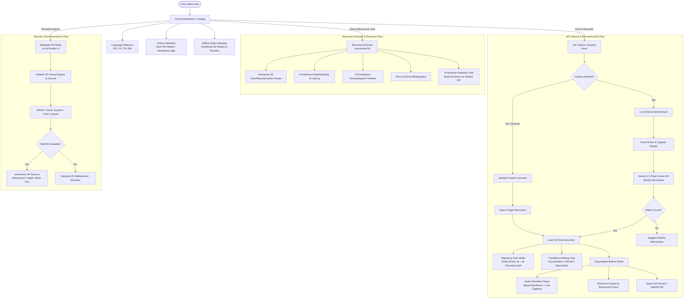
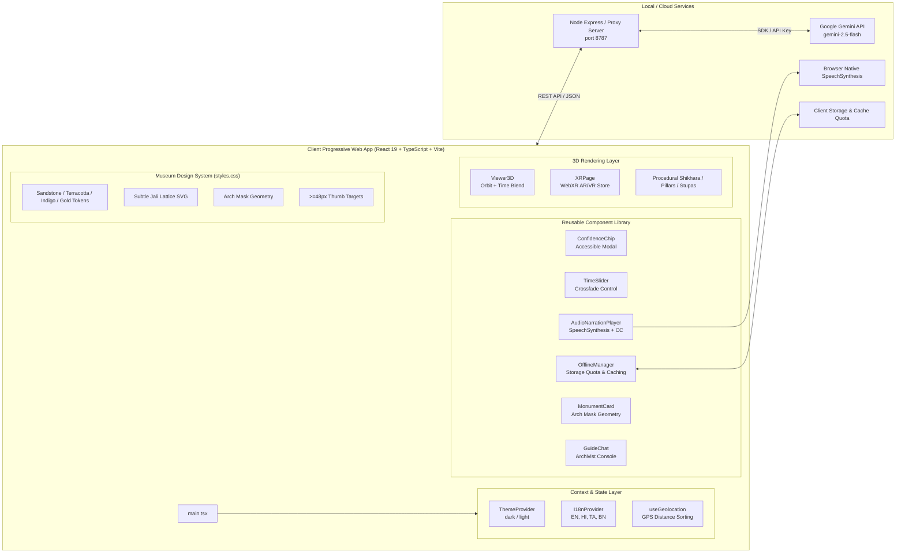
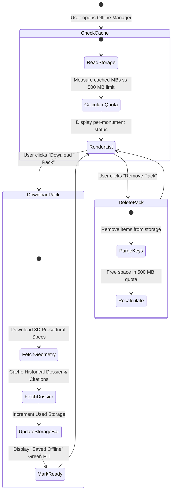
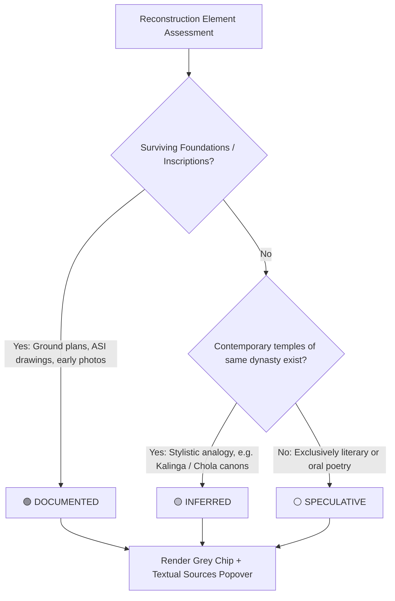

# Bharat Virasat XR — Architecture & User Workflow Diagrams

This document outlines the end-to-end user workflows, runtime data pipelines, and system architecture for **Bharat Virasat XR** — an open-source archaeological AR/VR progressive web application reconstructing India's ruined and destroyed monuments.

### Standalone Workflow Files
Each diagram and specification is also maintained in its own dedicated file:
1. 🧭 [**High-Level User Journey Workflow**](file:///c:/Users/rahul/OneDrive/Desktop/hackoctober%202026/workflows/user-journey-workflow.md)
2. 🏛️ [**System Architecture & Component Hierarchy**](file:///c:/Users/rahul/OneDrive/Desktop/hackoctober%202026/workflows/system-architecture.md)
3. 🏷️ [**Architectural Confidence Rating Logic**](file:///c:/Users/rahul/OneDrive/Desktop/hackoctober%202026/workflows/confidence-rating-logic.md)
4. 📷 [**AR Scanning & Reconstruction Pipeline**](file:///c:/Users/rahul/OneDrive/Desktop/hackoctober%202026/workflows/ar-scanning-pipeline.md)
5. 💾 [**Offline Packs & Storage Management State Flow**](file:///c:/Users/rahul/OneDrive/Desktop/hackoctober%202026/workflows/offline-storage-flow.md)

---

## 1. High-Level User Journey Workflow

---

## 2. AR Scanning & Reconstruction Pipeline (Sequence Diagram)

```mermaid
sequenceDiagram
    autonumber
    actor User as Field Visitor
    participant UI as AR Viewport (ScanPage)
    participant Media as Device Camera (MediaDevices API)
    participant Proxy as Local API Proxy (Port 8787)
    participant Gemini as Google Gemini 2.5 Flash
    participant DB as Monument Archival Database
    participant Three as Three.js / R3F Engine

    User->>UI: Taps "Point & Discover"
    UI->>Media: Request getUserMedia({ video: environment })
    Media-->>UI: Live Video Stream Attached
    User->>UI: Points camera at ruin and presses Shutter
    UI->>UI: Capture canvas frame (max 1024px JPEG)
    
    rect rgb(20, 26, 42)
        Note over UI,Gemini: AI Identification Step
        UI->>Proxy: POST /api/identify (base64 image + GPS lat/lng)
        Proxy->>Gemini: Multimodal Vision Prompt + Candidate IDs
        Gemini-->>Proxy: { monumentId, confidence, rationale }
        Proxy-->>UI: IdentifyResult JSON
    end

    UI->>DB: Fetch Monument Metadata & Confidence Ratings
    DB-->>UI: Complete Record (Confidence, Rationale, Sources, Timeline)
    
    UI->>Three: Mount 3D Scene overlaid on camera stream
    Three->>Three: Render Procedural Ruin Base
    Three->>Three: Render Reconstructed Superstructure (Initial Alpha: 0.0)

    rect rgb(35, 24, 18)
        Note over User,Three: Signature Time-Travel Interaction
        User->>UI: Drags Time Slider (0% Today -> 100% Past)
        UI->>Three: Interpolate opacity (lerp ruin -> intact golden era)
        Three-->>User: Smooth visual crossfade of destroyed architectural elements
    end

    User->>UI: Taps Confidence Chip (e.g. "Documented")
    UI-->>User: Opens Popover showing ASI excavation citations & rationale
    User->>UI: Slides up Bottom Sheet
    UI->>User: Audio narration plays with synchronized closed captions
```

---

## 3. System Architecture & Component Hierarchy

---

## 4. Offline Packs & Storage Management State Flow

---

## 5. Architectural Confidence Rating Logic

---

*Bharat Virasat XR is maintained as an open-source archaeological education initiative under the Hack October 2026 project.*
