# Bharat Virasat XR — AR Scanning & Reconstruction Pipeline

This document details the runtime sequence of operations during an in-situ AR camera scanning session, from device camera acquisition to AI identification, 3D model mounting, time slider crossfading, and bottom-sheet narration.

## Sequence Diagram

```mermaid
sequenceDiagram
    autonumber
    actor User as Field Visitor
    participant UI as AR Viewport (ScanPage)
    participant Media as Device Camera (MediaDevices API)
    participant Proxy as Local API Proxy (Port 8787)
    participant Gemini as Google Gemini 2.5 Flash
    participant DB as Monument Archival Database
    participant Three as Three.js / R3F Engine

    User->>UI: Taps "Point & Discover"
    UI->>Media: Request getUserMedia({ video: environment })
    Media-->>UI: Live Video Stream Attached
    User->>UI: Points camera at ruin and presses Shutter
    UI->>UI: Capture canvas frame (max 1024px JPEG)
    
    rect rgb(20, 26, 42)
        Note over UI,Gemini: AI Identification Step
        UI->>Proxy: POST /api/identify (base64 image + GPS lat/lng)
        Proxy->>Gemini: Multimodal Vision Prompt + Candidate IDs
        Gemini-->>Proxy: { monumentId, confidence, rationale }
        Proxy-->>UI: IdentifyResult JSON
    end

    UI->>DB: Fetch Monument Metadata & Confidence Ratings
    DB-->>UI: Complete Record (Confidence, Rationale, Sources, Timeline)
    
    UI->>Three: Mount 3D Scene overlaid on camera stream
    Three->>Three: Render Procedural Ruin Base
    Three->>Three: Render Reconstructed Superstructure (Initial Alpha: 0.0)

    rect rgb(35, 24, 18)
        Note over User,Three: Signature Time-Travel Interaction
        User->>UI: Drags Time Slider (0% Today -> 100% Past)
        UI->>Three: Interpolate opacity (lerp ruin -> intact golden era)
        Three-->>User: Smooth visual crossfade of destroyed architectural elements
    end

    User->>UI: Taps Confidence Chip (e.g. "Documented")
    UI-->>User: Opens Popover showing ASI excavation citations & rationale
    User->>UI: Slides up Bottom Sheet
    UI->>User: Audio narration plays with synchronized closed captions
```

## Step-by-Step Execution

1. **Hardware Acquisition (`navigator.mediaDevices.getUserMedia`)**:
   - Requests rear-facing camera (`facingMode: { ideal: 'environment' }`).
   - If blocked or running on a camera-less desktop, automatically renders an instant test carousel with distance-sorted nearby presets.
2. **Frame Capture & Normalization**:
   - Downsamples video stream to 1024px max side to ensure rapid upload on 3G/4G field connections.
3. **Multimodal Identification (`POST /api/identify`)**:
   - Transmits base64 JPEG and device GPS coordinates to Gemini 2.5 Flash.
   - Matches against monument catalog candidates with fallback to closest GPS coordinate if visual features are ambiguous.
4. **Time Slider Crossfade Interaction**:
   - Direct dual-layer opacity manipulation.
   - Layer 1: Weathered, damaged ruin mesh.
   - Layer 2: Intact gilded historical reconstruction.
5. **Progressive Curatorial Disclosure**:
   - Expandable bottom sheet presents verified historical accounts, catastrophe/destruction summaries, audio narration, and citations without cluttering the camera HUD.
