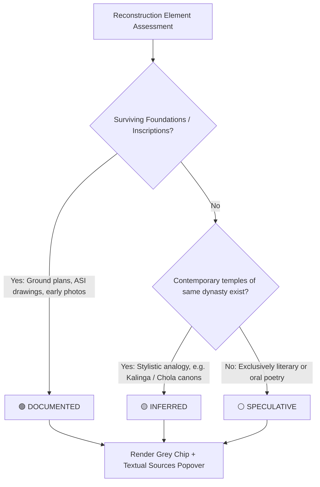

# Bharat Virasat XR — Architectural Confidence Rating Logic

This document defines the archaeological evidence framework and decision tree used to assign confidence classifications to every 3D reconstruction in **Bharat Virasat XR**.

## Decision Logic Diagram

## Confidence Levels & Classification Rubric

| Level | Badge Token | Definition | Example Archaeological Basis |
| :--- | :--- | :--- | :--- |
| **Documented** | 🟢 Green (`#4E9B66`) | High certainty backed by physical evidence. Foundations, plinth stones, floorplans, ASI survey drawings, or 19th-century colonial photography are available. | Nalanda Monastery 1 plinth, Martand Sun Temple peristyle, Shore Temple structural granite foundations. |
| **Inferred** | 🟡 Amber (`#E09F3E`) | Moderate certainty derived from comparative architectural analogy. Superstructures are modeled using intact contemporary structures of the same dynasty/period. | Konark Sun Temple lost 70m rekha deul modeled from Jagannath Temple, Puri and Lingaraja Temple, Bhubaneswar. |
| **Speculative** | ⚪ Grey (`#8C93A8`) | Low physical certainty based on literary chronicles, traveler travelogues, or oral folklore without surviving foundation masonry. | Quilon Chinese Pagoda, Seven Pagodas lost submerged temples referenced in British traveler accounts. |

## User Interface Implementation

Every 3D model renders a **`ConfidenceChip`** badge:
- **Interaction**: Tapping the chip triggers an accessible dialog popover.
- **Content**: Discloses the scientific rationale, dynastic stylistic analogues, and verbatim ASI/colonial report citations.
- **Ethical Integrity**: Prevents sensationalism by transparently separating verified archaeology from algorithmic or historical conjecture.
