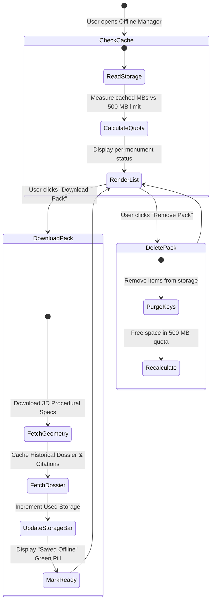

# Bharat Virasat XR — Offline Packs & Storage Management State Flow

This document details the client-side cache and offline storage state machine, allowing users to download 3D geometry packs, historical dossiers, and audio text transcripts for field use in remote archaeological sites lacking cellular reception.

## State Diagram

## Storage Specifications

- **Quota Cap**: 500 MB max client-side quota to preserve device flash storage on budget mobile phones.
- **Pack Sizes**: Range from 12 MB to 28 MB per monument (includes 3D geometry definitions, historical summaries, multi-script names, and cited source bibliography).
- **Progress Tracking**: Real-time progress bar with per-monument download percentage.
- **Purge Management**: One-click "Clear All Offline Cache" and individual delete buttons (`pack-del-btn`) to free space.
