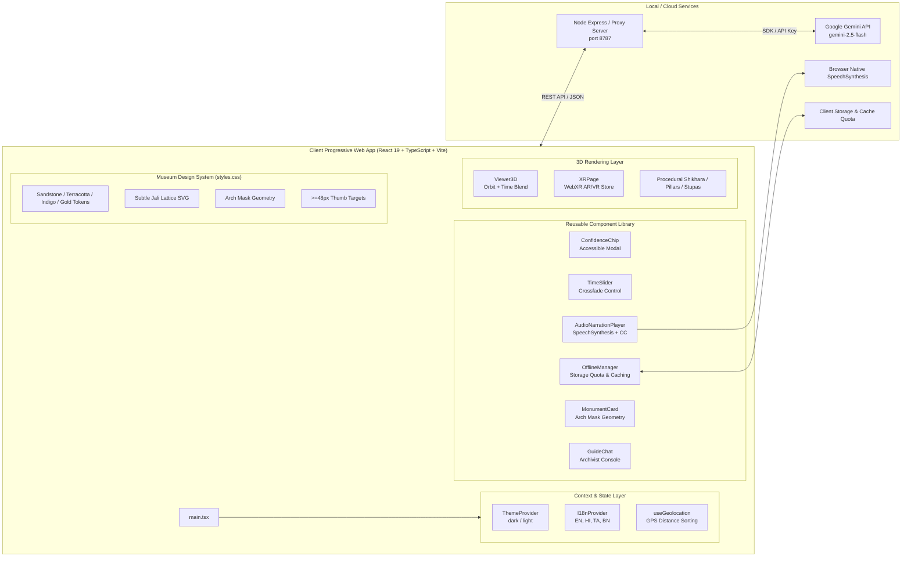

# Bharat Virasat XR — System Architecture & Component Hierarchy

This document details the modular software architecture, component relationships, state layers, and backend service integrations powering **Bharat Virasat XR**.

## Architecture Diagram

## Architectural Layers

### 1. Presentation & Styling Layer (`styles.css`)
- **Theme Palette Tokens**:
  - Dark Mode (`#0B0F19` Deep Indigo) is the default for AR camera feeds and outdoor contrast.
  - Light Mode (`#F5F0E4` Sandstone Beige) for ambient gallery reading.
  - Accent colors: `#C85A32` (Terracotta) and `#C5A059` (Muted Gold).
- **Architectural Motifs**: Arch card masks (`border-radius: 48px 48px 18px 18px`), delicate SVG diamond jali lattices, and WCAG AA contrast.
- **Ergonomics**: All primary interactive buttons strictly adhere to $\ge 48\text{px} \times 48\text{px}$ touch targets.

### 2. Context & State Management
- `ThemeProvider`: Manages `[data-theme='dark']` and `[data-theme='light']` with `localStorage` persistence.
- `I18nProvider`: Multi-script strings and dictionary support for English, Hindi, Tamil, and Bengali.
- `useGeolocation`: Coordinates acquisition with distance sorting (`sortByDistance`).

### 3. Component Hierarchy
- `ConfidenceChip`: Accessible popover displaying archaeological evidence and citations.
- `TimeSlider`: Dual-state percentage slider for smooth ruin-to-reconstruction crossfades.
- `AudioNarrationPlayer`: Text-to-speech engine using native browser `speechSynthesis` with speed toggles (0.85x, 1x, 1.25x) and read-along captions.
- `OfflineManager`: Storage quota visualization (MB / 500 MB) and cached pack lifecycle.
- `GuideChat`: AI museum archivist chat console with suggested query pills.

### 4. 3D & XR Rendering Engine
- **Three.js & React Three Fiber**: Procedural rendering of classical Indian architectural elements (shikharas, mandapas, gopurams, stupa chattras).
- **WebXR Device API**: Native AR hit-test placement on mobile devices and 6-DOF immersion on headsets.

### 5. Backend & Cloud Services
- **Node.js Proxy Server (`server/index.js`)**: Secure proxy on port 8787 handling Gemini API calls without exposing keys to clients.
- **Google Gemini 2.5 Flash**: Multimodal visual recognition of captured monument photos and historical dialogue generation.
