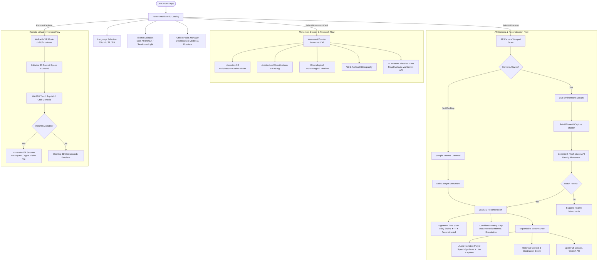

# Bharat Virasat XR — High-Level User Journey Workflow

This document illustrates the end-to-end user navigation journey across the application's core feature areas: preferences/onboarding, in-situ AR scanning, monument research dossiers, and remote virtual immersion.

## Workflow Diagram

## Key Touchpoints

1. **Dashboard Entry**:
   - Geolocation auto-detects nearest monuments (`formatKm`).
   - Catalog filtering by historical status (`All`, `Ruined`, `Submerged`, `Destroyed`).
   - Multi-script support: English, Hindi (हिन्दी), Tamil (தமிழ்), and Bengali (বাংলা).

2. **In-Situ Camera Flow**:
   - 48px+ thumb-friendly shutter button.
   - Dual-mode: Camera live stream or zero-webcam preset carousel fallback.
   - Signature Time Slider: dynamic crossfade between ruin geometry and 3D reconstructed superstructure.

3. **Curatorial Dossier Flow**:
   - 3D interactive viewer with orbit/zoom controls.
   - Audio narration player with playback speed selector and live read-along closed captions.
   - Verified bibliography of ASI survey reports and colonial architectural drawings.
   - Interactive museum archivist console (`GuideChat`).

4. **Walkable VR Immersion**:
   - WebXR immersive session on headsets (Meta Quest, Apple Vision Pro).
   - Touch joystick and keyboard WASD orbit controls for desktop/mobile browsers.
